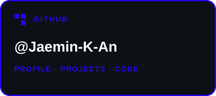
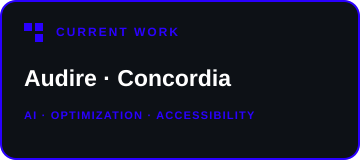
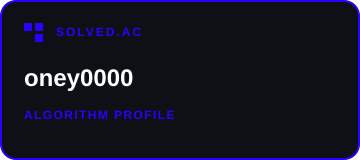

<!-- Figma source: OeFbOcvsRx2VXisNkJ5roD · Naming 1:2/28:4 · Symbol 28:2 -->

  <picture>
    <source media="(prefers-color-scheme: dark)" srcset="./assets/naming-image-dark.png" />
    <source media="(prefers-color-scheme: light)" srcset="./assets/naming-image-light.png" />
    
  </picture>

<table>
  <tr>
    <td width="68%" valign="middle">
      <h2>Jaemin / orcidsharx</h2>
      
<strong>Student developer at Daejeon Daeshin High School.</strong>

      
I turn difficult, slightly strange problems into things people can actually use—across AI, optimization, accessibility, and the web.

      
<code>observe</code> → <code>model</code> → <code>build</code> → <code>iterate</code>

    </td>
    <td width="32%" align="center">
      
    </td>
  </tr>
</table>

## 01 / Tech stack

  
  
  
  
  
  
  
   
  
  
  
  
  
  

## 02 / Current work

<table>
  <tr>
    <td width="33%" valign="top">
      <h3><a href="https://github.com/Jaemin-K-An/Audire">Audire</a></h3>
      
Personalized speech-perception profiling for Korean mishearing prediction and selective captioning.

      
<code>Python</code> · speech · accessibility

    </td>
    <td width="33%" valign="top">
      <h3><a href="https://github.com/Jaemin-K-An/Concordia">Concordia</a></h3>
      
Congestion-aware optimization and reinforcement of driver-interest alignment for coordinated navigation.

      
<code>Python</code> · optimization · navigation

    </td>
    <td width="33%" valign="top">
      <h3><a href="https://github.com/Jaemin-K-An/Sensus">Sensus</a></h3>
      
An instruction-oriented accessibility project for people with visual impairments.

      
<code>TypeScript</code> · web · accessibility

    </td>
  </tr>
</table>

## 03 / Signals

<table>
  <tr>
    <td width="33%" align="center">
      
    </td>
    <td width="33%" align="center">
      
    </td>
    <td width="33%" align="center">
      
    </td>
  </tr>
</table>

  
   
  My dream is Archmage 🪄

